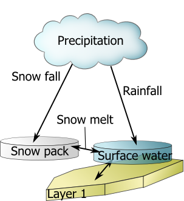

@page CmfTutSnow.md

[index...](CmfTutStart.md) [back...](CmfTutIntercept.md)

# Snow (under construction)

For this tutorial, we are using the simplified model (without canopy)
from the [last](CmfTutIntercept.md) tutorial.

## Implementation of a snow storage



As shown in the figure, we need to create a snow pack water storage,
split the rainfall between rain and snow, depending on air temperature
and set a snow melt connection between snow and surface water.

### Creating the snow storage

Adding a snow storage to the cell

``` {.py}

c.add_storage('Snow','S')
```

### Splitting rainfall

The automatically created connection between rain and surfacewater
([Rainfall](@ref cmf::upslope::connections::Rainfall) checks if the
cell has a snow storage, and assumes if the snow storage is present,
that `Rainfall` should only transfer rain and not snow. However, to
have this working properly we need also a
[Snowfall](@ref cmf::upslope::connections::Snowfall) connection from
the rain source to the snow pack:

``` {.py}

cmf.Snowfall(c.snow,c)
```

The split between snow and rain depends on the air temperature (T) of
the actual [Weather](@ref cmf::atmosphere::Weather) of the cell. If
@f$T < T_{thres} - 1^\circ C@f$, where @f$T_{thres}=0.0 ^\circ C@f$
by default, all precipitation is handeled as snow, and for `@f$T <
T_{thres} + 1^\circ C@f$` precipitation is handeled as rain. For
@f$|T-T_{thres}|<1K@f$ precipitation is handled as sleet, a linear mix
between snow and rain. Sleet in cmf has its origin in numerical problems
when switching during one time step between snow and rain, but fits
reality quite nice...

@f$T_{thres}@f$ can be set for the whole model with the function
`cmf.Weather.set_snow_threshold(Tres)`.

### Snow melt

CMF provides a very simple temperature index snow melt model
([SimpleTindexSnowMelt](@ref cmf::upslope::connections::SimpleTindexSnowMelt))
in the form @f$q_{melt} [mm/day] = (T-T_{thres}) r@f$ where T is the
actual temperature, @f$T_{thres}@f$ the same value as above and
@f$r@f$ is the snow melt rate in @f$\frac{mm}{K\ day}@f$. The
connection is set up for cmf revisions \>1000:

``` {.py}

snowmelt = cmf.SimpleTindexSnowMelt(c.snow,c.surfacewater,c,rate=7.0)
```

For older cmf versions you need to do:

``` {.py}

snowmelt = cmf.SimpleTindexSnowMelt(c.snow,c.surfacewater,c)
snowmelt.SnowMeltRate = 7.0
```

author: philipp, version: 3 Mon Oct 17 12:21:37 2016
